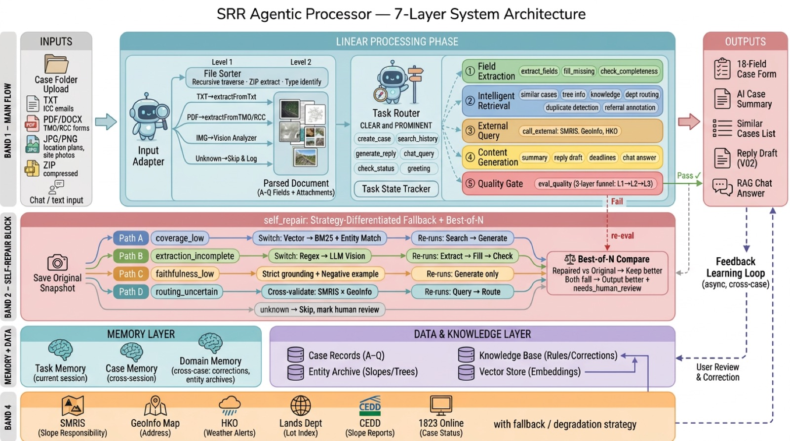
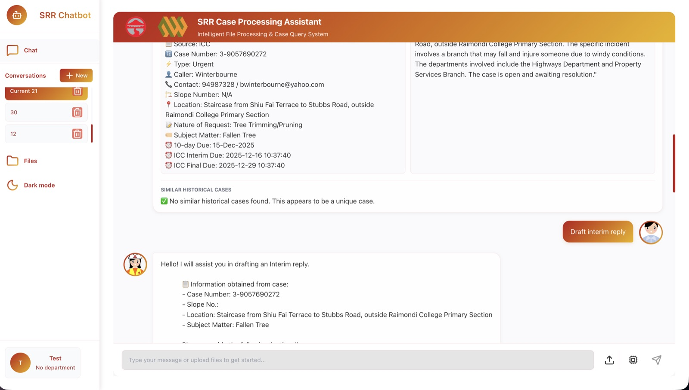
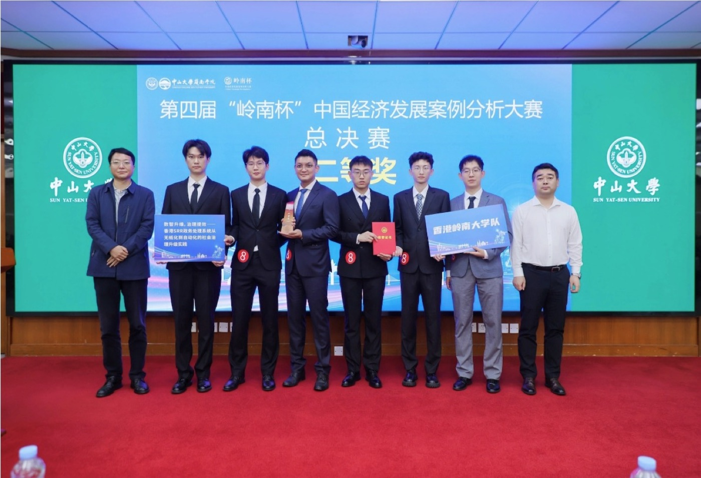

# SRR Agentic Case Processing System


A compact Python reference implementation for converting unstructured service-request text into validated, routed, deadline-aware case records.



## Overview

| Input | Workflow | Output |
|---|---|---|
| Unstructured service-request text | Extract, validate, repair, route, calculate deadlines | Reviewable case record with quality score |

```text
case text
  -> field extraction
  -> validation and repair
  -> deadline calculation
  -> department routing
  -> quality-gated case record
```

## Highlights

| Capability | Implementation |
|---|---|
| Agentic workflow | Multi-step state handoff across extraction, validation, routing, and repair |
| Operational rules | Deadline calculation and confidence-based department routing |
| Reviewability | Explicit missing-field checks, validation errors, and repair log |
| Public demo | Synthetic fixtures, unit tests, and a small FastAPI wrapper |

## Demo

```bash
PYTHONPATH=src python3 scripts/run_demo.py
```

Expected output shape:

```json
{
  "fields": {
    "case_number": "DEMO-2026-0001",
    "request_type": "Urgent",
    "subject_matter": "Fallen Tree",
    "works_completion_due": "20-Jan-2026"
  },
  "department_routing": {
    "department": "Tree Management Team",
    "confidence": 0.91
  },
  "quality": {
    "score": 1.0,
    "level": "pass"
  }
}
```

## Recognition

| System Interaction | Lingnan Cup |
|---|---|
|  |  |

Official competition coverage: <https://lingnan.sysu.edu.cn/article/3596>

## Public Scope

| Included | Not Included |
|---|---|
| Synthetic case fixture | Real case documents |
| Reference rule modules | Deployment configuration |
| Unit tests | API keys, database credentials, cloud configs |
| FastAPI wrapper sample | Prompt templates or internal workflow notes |

## Quick Start

```bash
python3 -m venv .venv
source .venv/bin/activate
pip install -e .
PYTHONPATH=src python scripts/run_demo.py
python -m unittest discover -s tests
```

Optional API wrapper:

```bash
pip install -e ".[api]"
uvicorn srr_public.api:app --reload
```

Then open:

```text
http://127.0.0.1:8000/docs
```

## Code Tour

| Step | File | Purpose |
|---|---|---|
| 1 | `src/srr_public/pipeline.py` | Overall orchestration and state handoff |
| 2 | `src/srr_public/field_extractor.py` | Deterministic extraction boundary for public demo |
| 3 | `src/srr_public/quality_gate.py` | Required-field checks and rule-level validation |
| 4 | `src/srr_public/self_repair.py` | Explainable repair instead of silent hallucination |
| 5 | `src/srr_public/router.py` | Rule-based department routing with confidence |
| 6 | `tests/` | Behavior checks with synthetic cases |

## More Details

- [Architecture notes](docs/ARCHITECTURE.md)
- [Public scope](docs/PUBLIC_SCOPE.md)

## License

MIT.
